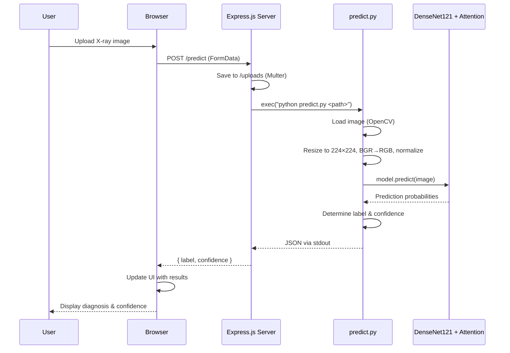

<](https://python.org)
[](https://tensorflow.org)
[](https://nodejs.org)
[](#disclaimer)

</div>

---

## 📋 Table of Contents

- [Overview](#-overview)
- [Key Features](#-key-features)
- [Architecture](#-architecture)
  - [Model Architecture](#model-architecture)
  - [System Architecture](#system-architecture)
- [Project Structure](#-project-structure)
- [Dataset](#-dataset)
- [Model Training Pipeline](#-model-training-pipeline)
  - [Data Preprocessing](#1-data-preprocessing)
  - [Data Augmentation](#2-data-augmentation)
  - [Model Building](#3-model-building)
  - [Training Strategy](#4-training-strategy)
  - [Fine-Tuning](#5-fine-tuning)
- [Model Performance](#-model-performance)
- [Tech Stack](#-tech-stack)
- [Installation & Setup](#-installation--setup)
  - [Prerequisites](#prerequisites)
  - [Steps](#steps)
- [Usage](#-usage)
  - [Web Interface](#web-interface)
  - [CLI Prediction](#cli-prediction)
  - [API Endpoint](#api-endpoint)
- [How It Works](#-how-it-works)
- [Disclaimer](#-disclaimer)

---

## 🔬 Overview

**PneumoScan AI** is a full-stack web application that leverages a convolutional neural network (CNN) to detect pneumonia from chest X-ray images. The project combines a **DenseNet121** backbone with a **custom attention mechanism** to improve classification accuracy, backed by a responsive web interface built with vanilla HTML/CSS/JS and served through an Express.js backend.

The model was trained on the [Chest X-Ray Images (Pneumonia)](https://www.kaggle.com/datasets/paultimothymooney/chest-xray-pneumonia) dataset from Kaggle, achieving **~88% test accuracy** and a **0.95 AUC score**.

---

## ✨ Key Features

| Feature | Description |
|---|---|
| 🧠 **Hybrid CNN Architecture** | DenseNet121 backbone + custom attention mechanism for enhanced feature extraction |
| 🖥️ **Modern Web Interface** | Responsive, premium UI branded as "PneumoScan AI" with drag-and-drop uploads |
| ⚡ **Real-Time Predictions** | Upload an X-ray and receive classification results with confidence scores in seconds |
| 📊 **Confidence Visualization** | Animated confidence meter with color-coded indicators (red for pneumonia, green for normal) |
| 🔄 **Two-Phase Training** | Transfer learning followed by fine-tuning for optimal performance |
| 📱 **Responsive Design** | Fully responsive layout across desktop, tablet, and mobile devices |
| 🖱️ **Drag & Drop Upload** | Intuitive image upload via click or drag-and-drop |

---

## 🏗️ Architecture

### Model Architecture

The model uses a **hybrid architecture** combining transfer learning with a custom attention mechanism:

```
Input (224×224×3)
    │
    ▼
┌─────────────────────┐
│   DenseNet121        │ ← Pre-trained on ImageNet (frozen initially)
│   (Feature Extractor)│
└─────────┬───────────┘
          │
          ▼
  GlobalAveragePooling2D
          │
    ┌─────┴──────┐
    │            │
    ▼            ▼
┌────────┐  ┌──────────────┐
│ Main   │  │  Attention   │
│ Path   │  │  Branch      │
│        │  │              │
│        │  │ Dense(256)   │
│        │  │ BatchNorm    │
│        │  │ Dropout(0.5) │
│        │  │ Dense(1,σ)   │
└───┬────┘  └──────┬───────┘
    │              │
    └───── × ──────┘   ← Element-wise Multiply (Attention Weighting)
           │
           ▼
    Dense(512, ReLU, L2)
    BatchNorm → Dropout(0.6)
           │
    Dense(256, ReLU, L2)
    BatchNorm → Dropout(0.5)
           │
    Dense(1, Sigmoid)
           │
           ▼
      Output: [0, 1]
   (0 = PNEUMONIA, 1 = NORMAL)
```

**Total Parameters:** 7,960,642 (~30.37 MB)
- **Trainable (initial phase):** 921,090 (~3.51 MB)
- **Non-trainable:** 7,039,552 (~26.85 MB)

### System Architecture

```
┌─────────────────────────────────────────────────────────────┐
│                        Client Browser                        │
│                                                              │
│  ┌──────────────────────────────────────────────────────┐   │
│  │          public/index.html (PneumoScan AI)            │   │
│  │                                                       │   │
│  │  • Drag & drop / click upload area                    │   │
│  │  • Image preview with FileReader API                  │   │
│  │  • Processing spinner overlay                         │   │
│  │  • Animated confidence meter                          │   │
│  │  • Color-coded result display                         │   │
│  └──────────────────┬───────────────────────────────────┘   │
│                     │ POST /predict (FormData)               │
└─────────────────────┼───────────────────────────────────────┘
                      │
                      ▼
┌─────────────────────────────────────────────────────────────┐
│              server.js (Express.js + Multer)                  │
│                                                              │
│  • Serves static files from /public                          │
│  • SPA fallback routing via catch-all GET                    │
│  • POST /predict                                             │
│    ├── Multer: save upload to /uploads                       │
│    ├── File filter: .jpg, .jpeg, .png only                   │
│    ├── Spawn: python predict.py <image_path>                 │
│    ├── Parse JSON from stdout (last valid JSON line)         │
│    └── Return { label, confidence } or { error }             │
│  • CORS enabled                                              │
│  • Runs on port 3000                                         │
└──────────────────────┬──────────────────────────────────────┘
                       │
                       ▼
┌─────────────────────────────────────────────────────────────┐
│               predict.py (Python + TensorFlow)               │
│                                                              │
│  • Loads model from model_weight/vgg19_model_final.h5        │
│  • Preprocessing:                                            │
│    ├── Read image with OpenCV                                │
│    ├── Resize to 224×224                                     │
│    ├── Convert BGR → RGB                                     │
│    └── Normalize to [0, 1]                                   │
│  • Handles both sigmoid (1 output) and softmax (2 outputs)   │
│  • Outputs JSON to stdout: { label, confidence }             │
│  • Debug logs to stderr                                      │
└─────────────────────────────────────────────────────────────┘
```

---

## 📁 Project Structure

```
Pneumonia_Detection-main/
├── model_weight/                    # Model weights directory (git-ignored)
│   └── vgg19_model_final.h5         # Final trained model (~30 MB)
├── public/                          # Static frontend assets
│   └── index.html                   # Single-page application (867 lines)
│                                    #   - Responsive CSS (custom properties)
│                                    #   - Poppins font (Google Fonts)
│                                    #   - Font Awesome icons
│                                    #   - Vanilla JS: upload, fetch, UI updates
├── uploads/                         # Uploaded images stored here by Multer
├── hybrid.ipynb                     # Jupyter notebook for model training
│                                    #   - Data loading & preprocessing
│                                    #   - DenseNet121 + attention model build
│                                    #   - 50-epoch training + 10-epoch fine-tuning
│                                    #   - Evaluation & confusion matrix
├── predict.py                       # CLI/backend prediction script
├── server.js                        # Express.js API server
├── package.json                     # Node.js dependencies
├── package-lock.json                # Dependency lock file
├── .gitignore                       # Ignores model_weight/
└── README.md                        # This file
```

---

## 📊 Dataset

The project uses the **Chest X-Ray Images (Pneumonia)** dataset from Kaggle:

| Split | PNEUMONIA | NORMAL | Total |
|-------|-----------|--------|-------|
| Train | ~3,875 | ~1,341 | ~5,216 |
| Validation | ~8 | ~8 | ~16 |
| Test | ~390 | ~234 | ~624 |

> **Note:** The dataset is imbalanced (PNEUMONIA ≈ 74.3% of training data). The training pipeline handles this using **computed class weights** via `sklearn.utils.class_weight`.

---

## 🔧 Model Training Pipeline

The complete training pipeline is documented in [`hybrid.ipynb`](hybrid.ipynb):

### 1. Data Preprocessing

```python
img_size = 224  # Input resolution

# For each image:
# 1. Load as grayscale
img_src = cv2.imread(img_path, cv2.IMREAD_GRAYSCALE)
# 2. Apply histogram equalization (enhances contrast)
img_src = cv2.equalizeHist(img_src)
# 3. Resize to 224×224
resized_arr = cv2.resize(img_src, (img_size, img_size))
# 4. Convert to 3-channel (required by DenseNet121)
resized_arr = np.stack((resized_arr,)*3, axis=-1)
# 5. Normalize pixel values to [0, 1]
resized_arr = resized_arr / 255.0
```

### 2. Data Augmentation

Applied **only** to training data via `ImageDataGenerator`:

| Augmentation | Value |
|---|---|
| Rotation | ±10° |
| Width Shift | ±10% |
| Height Shift | ±10% |
| Shear | 0.1 |
| Zoom | ±10% |
| Horizontal Flip | ✅ |
| Fill Mode | Nearest |

### 3. Model Building

The hybrid model combines:
- **DenseNet121** (pre-trained on ImageNet, frozen base) as the feature extractor
- **Custom attention mechanism** — learns a scalar attention weight via a mini-network and multiplies it with the feature vector
- **Classification head** — two Dense layers with BatchNormalization, Dropout, and L2 regularization

### 4. Training Strategy

| Hyperparameter | Value |
|---|---|
| Optimizer | Adam |
| Learning Rate | 1e-4 |
| Loss Function | Binary Cross-Entropy |
| Batch Size | 32 |
| Epochs | 50 |
| Class Weights | Auto-computed (balanced) |

**Callbacks:**
- `EarlyStopping` — patience=8, restores best weights
- `ReduceLROnPlateau` — factor=0.2, patience=4, min_lr=1e-7
- `ModelCheckpoint` — saves best model
- `TensorBoard` — training logs

### 5. Fine-Tuning

After the initial 50-epoch training, the **last 20 layers of DenseNet121** are unfrozen and the model is further trained:

| Hyperparameter | Value |
|---|---|
| Learning Rate | 1e-5 (10× lower) |
| Epochs | 10 additional |
| Loss Function | Binary Cross-Entropy |

This fine-tuning phase allows the pre-trained feature extractor to adapt its learned representations to the medical imaging domain.

---

## 📈 Model Performance

### Test Set Results (624 images)

| Metric | Score |
|---|---|
| **Accuracy** | 87.98% |
| **Precision** | 88.41% |
| **Recall** | 78.21% |
| **AUC** | 95.31% |

### Classification Report

```
              precision    recall  f1-score   support

   PNEUMONIA       0.88      0.94      0.91       390
      NORMAL       0.88      0.78      0.83       234

    accuracy                           0.88       624
   macro avg       0.88      0.86      0.87       624
weighted avg       0.88      0.88      0.88       624
```

### Training Progression (50 epochs)

| Epoch | Train Acc | Train AUC | Val Acc | Val AUC |
|-------|-----------|-----------|---------|---------|
| 1 | 62.6% | 75.9% | 87.5% | 89.1% |
| 10 | 91.1% | 97.1% | 87.5% | 96.9% |
| 20 | 92.5% | 97.8% | 87.5% | 100% |
| 30 | 94.5% | 98.2% | 87.5% | 100% |
| 40 | 93.2% | 98.0% | 87.5% | 100% |
| 50 | 94.1% | 98.5% | 93.8% | 100% |

---

## 🛠️ Tech Stack

### Backend
| Technology | Purpose |
|---|---|
| **Node.js + Express 5** | Web server and API routing |
| **Multer 2** | Multipart file upload handling |
| **CORS** | Cross-origin resource sharing |
| **child_process (exec)** | Python script execution |

### Machine Learning
| Technology | Purpose |
|---|---|
| **Python 3.12** | ML scripting language |
| **TensorFlow / Keras** | Deep learning framework |
| **OpenCV (cv2)** | Image loading and preprocessing |
| **NumPy** | Numerical computations |
| **scikit-learn** | Class weight computation and metrics |
| **scikit-image** | Image segmentation utilities |
| **Matplotlib / Seaborn** | Training visualization |
| **Pandas** | Data manipulation |

### Frontend
| Technology | Purpose |
|---|---|
| **HTML5** | Page structure and semantics |
| **CSS3** (Custom Properties) | Responsive styling with variables |
| **Vanilla JavaScript** | Image upload, API calls, DOM updates |
| **Google Fonts** (Poppins) | Typography |
| **Font Awesome 6** | UI iconography |

---

## 🚀 Installation & Setup

### Prerequisites

- **Node.js** (v18+ recommended)
- **Python** (3.10+ recommended)
- **pip** (Python package manager)

### Steps

**1. Clone the repository**

```bash
git clone https://github.com/Md-Shamir-raza/Pneumonia-Detection-using-CNN.git
cd Pneumonia-Detection-using-CNN
```

**2. Install Node.js dependencies**

```bash
npm install
```

**3. Set up Python environment**

```bash
python -m venv .venv

# Activate virtual environment
# On Linux / macOS:
source .venv/bin/activate
# On Windows:
.venv\Scripts\activate

# Install Python dependencies
pip install tensorflow opencv-python numpy scikit-learn
```

**4. Download / place model weights**

Make sure the trained model file exists at:
```
model_weight/vgg19_model_final.h5
```

> If you want to train the model yourself, run the [`hybrid.ipynb`](hybrid.ipynb) notebook with the [Chest X-Ray dataset](https://www.kaggle.com/datasets/paultimothymooney/chest-xray-pneumonia) placed as `archive.zip` in the project root.

**5. Configure Python path (if needed)**

The server uses the system `python` command by default. If your Python is at a different path, update the `command` variable in [`server.js`](server.js#L35):

```javascript
// server.js, line 35
const command = `python ${pythonScript} "${imagePath}"`;
// Change 'python' to your python path, e.g.:
// const command = `.venv/bin/python ${pythonScript} "${imagePath}"`;
```

**6. Start the server**

```bash
node server.js
```

The application will be available at: **http://localhost:3000**

---

## 💻 Usage

### Web Interface

1. Open **http://localhost:3000** in your browser
2. Scroll to the **"Upload Chest X-Ray"** section
3. **Click** the upload area or **drag & drop** an X-ray image (JPG/JPEG/PNG)
4. Wait for the AI model to process the image
5. View results:
   - **PNEUMONIA Detected** (red indicator) or **Normal** (green indicator)
   - Confidence percentage with animated meter
6. Click **"Analyze Another"** to test a new image

### CLI Prediction

You can run predictions directly from the command line:

```bash
python predict.py path/to/chest-xray.jpg
```

**Output (stdout):**
```json
{"label": "PNEUMONIA", "confidence": 97.5}
```

or

```json
{"label": "NORMAL", "confidence": 92.3}
```

Debug information is printed to **stderr** for troubleshooting.

### API Endpoint

**`POST /predict`**

| Parameter | Type | Description |
|---|---|---|
| `image` | File (multipart/form-data) | Chest X-ray image (JPG/JPEG/PNG) |

**Success Response (200):**
```json
{
  "label": "PNEUMONIA",
  "confidence": 97.5
}
```

**Error Response (400/500):**
```json
{
  "error": "No image uploaded."
}
```

**Example with cURL:**
```bash
curl -X POST -F "image=@chest_xray.jpg" http://localhost:3000/predict
```

---

## ⚙️ How It Works



1. **Image Upload** — The user uploads a chest X-ray via the browser. The file is sent as `multipart/form-data` to the server.
2. **File Handling** — Express.js + Multer receives the file, validates the extension (JPG/JPEG/PNG), and saves it to the `uploads/` directory.
3. **Python Invocation** — The server spawns `predict.py` as a child process, passing the saved image path as an argument.
4. **Preprocessing** — OpenCV loads the image, resizes it to 224×224, converts BGR to RGB color space, and normalizes pixel values to [0, 1].
5. **Prediction** — TensorFlow loads the pre-trained DenseNet121 + Attention model and runs inference. The script intelligently handles both sigmoid (single output) and softmax (two outputs) model formats.
6. **Response** — The prediction (label + confidence %) is printed as JSON to stdout, which the Express server parses and returns to the browser.
7. **Results Display** — The frontend displays a color-coded result card with an animated confidence bar.

---

## ⚠️ Disclaimer

> **This project is intended for educational and experimental purposes only.**
>
> - The prediction results should **NOT** be used as a final medical diagnosis.
> - Always consult a qualified healthcare professional for medical advice.
> - Uploaded images are stored in the `uploads/` directory on the server.
> - The model was trained on a specific dataset and may not generalize to all clinical scenarios.

---

<div align="center">

**Built with ❤️ using TensorFlow, Express.js, and a passion for AI in healthcare.**

</div>
]]>
